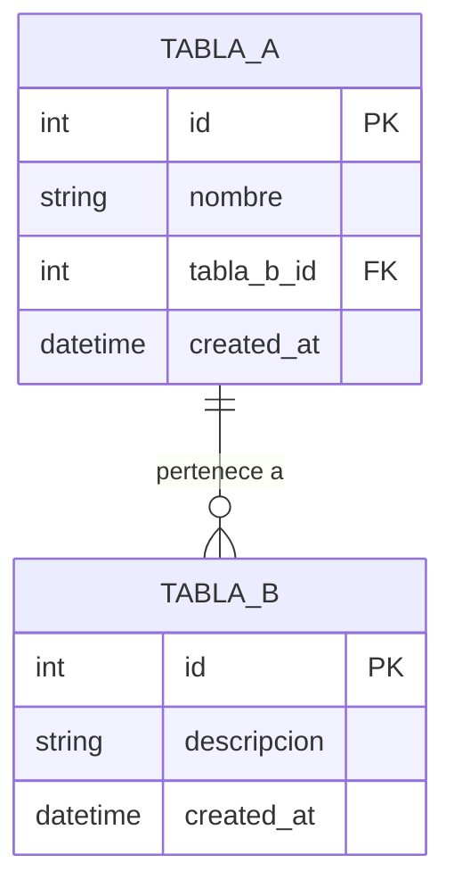

# Base de Datos — [Nombre del Proyecto]

## Diagrama ER

---

## Tablas

### [nombre_tabla]

[Para qué sirve esta tabla en el sistema.]

| Campo | Tipo | Descripción |
|---|---|---|
| id | UUID / INT | Identificador único |
| [campo] | [tipo] | [para qué sirve] |
| created_at | DATETIME | Fecha de creación |
| updated_at | DATETIME | Última actualización |

**Índices:**
- `[campo]` — [razón del índice]

**Relaciones:**
- Pertenece a `[otra_tabla]` via `[campo_fk]`
- Tiene muchos `[otra_tabla]`

---

## Decisiones de Diseño

[Decisiones importantes sobre la estructura que no son obvias.
Por qué se normalizó o desnormalizó algo, UUID vs INT, etc.]
