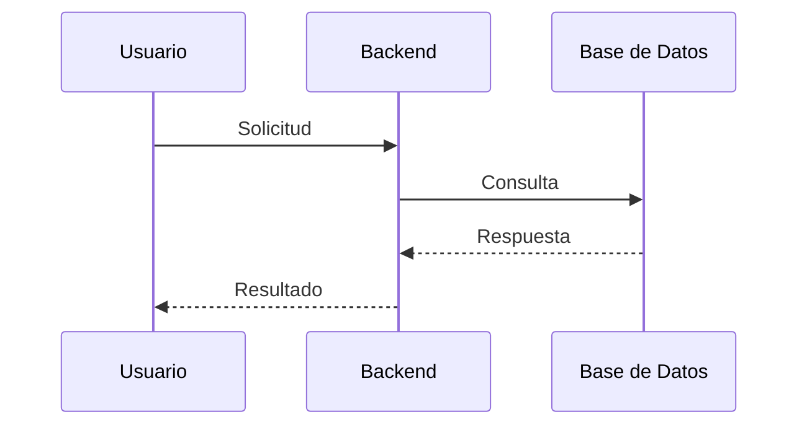
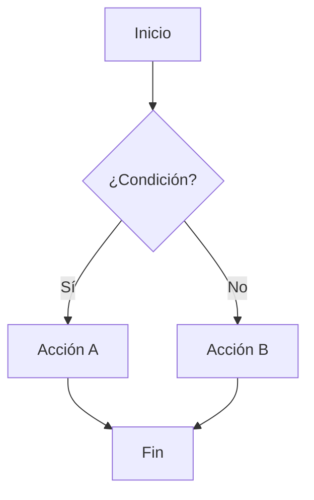
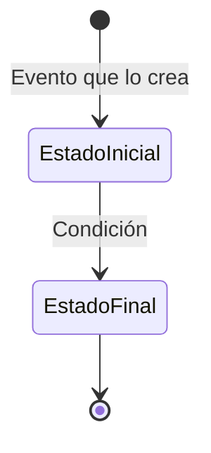

# Flujos — [Nombre del Proyecto]

## Flujo 1: [Nombre del Flujo]

[Descripción en 2-4 oraciones: qué desencadena este flujo, qué actores participan,
qué decisiones se toman y cuál es el resultado esperado.]

---

## Flujo 2: [Nombre del Flujo]

[Descripción]

---

## Máquinas de Estados

### [Nombre de la Entidad]

[Qué representa cada estado y qué transiciones son posibles.]

| Estado | Descripción |
|---|---|
| EstadoInicial | [Qué significa] |
| EstadoFinal | [Qué significa] |
